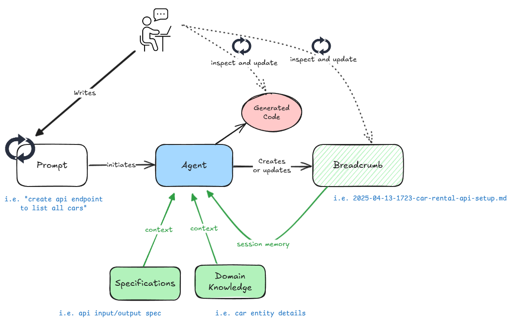

# Narrative

I'm a senior software engineer in the Dropbear crew which part of the ANZ engineering studio within Industry Solution Engeering (ISE) team here at Microsoft. I want to share some of my learnings working with large language models over the last 18+ months for code generation within a larger Hyper Velocity Engineering (HVE) initiative.

The industry as a whole has been figuring out how to harness the best out of LLMs for code generation since the eraly days of OpenAI's GPT 3.5. Coding agents wern't mainstream and using UX built for chat experiences had some key challenges that surfaced over that time.

Some of them were
- Inconsistency with the accuracy and style of the code assets produced.
- Inabilty to properly understand the nuanced context of how solutions were put together.
- Falling off the context size cliff fast and often.

Like every other engineer in the industry, I was trying to workout the best workflows to get the best out of LLMs for code generation while minimising the impact of these challenges.

## Where It Started

My team was working with one of the largest financial instutitions here in Austrlia during those months and we had unique contrains put on us around what LLM models could be used and how. This organisation had their own model gateway and an interface to access to vetted models via a web portal within a similar UX to ChatGPT.

I was using GPT 3.5 for activities like bootstrapping Python FastAPI applications, low fidelity architecture designs, class/function skeletons and completing those skeletons with functional code. It wasn't a smooth experience. The tools weren't integrated with the IDE and it required a lot of manual effort to coordinate.

But some important lessons started formulating. The model router would routinely get hit with rate limits and the web portal used to interact with these models would go offline for updates as the team maintaining it would also be doing updates and fixes. I would be in the middle of a session and lose important "chat history" when this happened. Often having to resort to start a new session and hoping I could get the thread to the roughly same "state" through prompting. Even when the concept of session preservation was introduced to the app, long running sessions meant that the context window was hit fast without any real means to preserve important aspects.

This is when the need for "Context Engineering" was really felt. I needed a way to prune/summarize my conversation history and externalize this so I could reuse it as required.

## How I Went About It

I started with putting more effort in to planning using the LLM. Breaking up the plan in to smaller tasks with my input to fine tune them. Before trying to generate any code, I ensured this "planning" document had included implicit knowledge (i.e. existing unique code samples, special patterns etc) about the project and requirements. Considering this document as a handover document the next phase of implementation, The plan in the document were still for things engineers would generally think of as smaller units of work (i.e. implement an class, refactoring, writing tests). They wern't the kind of broad activities that modern coding agents generate as plans.

I would then save these plans as external markdown files, and for each task in the plan, sequentially create a new chat thread with the input being the plan plus any important observations from the previous task. This planning document grew slowly but captured "just enough" context for consistent continuity.

This technique allowed me to produce more accurate code more often, and even when there were issues with the generated code, recover to a previous checkpoint easily while enriching the document with information about why things went wrong. I was able to do experiments more often and try various prototypes without having to start over each time.

## Coding Agents

It was early 2025 and the industry was coming to a realization about what LLMs can actually do in the engineering space thanks to models like Claude Sonnet 3.7. There was an exciting eco-system of coding agents coming up as well. The combination of these things made the AI assisted code generation workflows evolve fast. My team were experimenting with coding agents and prompts that instructed the agents to carry out multi step plans with human supervision.

The same broader problem of "context misalignment" still plaugues the agentic coding experience. This manifested in several ways:

- Inconsistent Implementation: Without access to the full context and reasoning behind previous decisions, AI suggestions may contradict established patterns or architectural choices.
- Knowledge Silos: Critical decisions and their rationale remain trapped in ephemeral conversations or, worse, only in the developer’s mind, making it difficult for team members (and the agent) to understand the “why” behind implementation choices.
- Progress Fragmentation: Development becomes a series of disconnected interactions rather than a coherent journey, making it challenging to maintain momentum across sessions.

The cost of this misalignment grows as development continues. Code reviews become more difficult, onboarding new team members takes longer, and the AI becomes less effective as a collaborator rather than more effective over time. What starts as minor friction eventually creates significant drag on development velocity.

## Fine Tuning The Workflow

The previous "planning" documents I created for my AI assisted engineering workflow needed to evolve in order to be more effective in this new environment of more capable models, larger context windows and agents.

I wanted these documents to be first class citizens within a code repo and not some throw away assets you use for one coding session. There was a requirement to scaffold the repository so that implicit context was easily discoverable to agents. This meant documenting important design requirements and any repo specific patterns. Markdown was a really effective way to achieve this as it acted as an easily editable, human readable document that agents also understood.

I used a workflw which instructed the agent to continiously externalize the memory to a file called a "breadcrumb". The breadcrumb was not just a place for your conversation history. It captured "just enough" information gathered through analyzing code, reading documentation and human feedback using the agent. It represented a scratch pad where the engineer and agent could "align" on their understanding of the task.

This simple yet powerful concept allowed me let the agent be liberal with its suggestions while having the safety net of being able to restart a new session without losing important context if things didn't pan out well. It was a way to give your agent super powers by giving it hindsight. Continously pruning and summarizing this file allowed me to stay within the contect boundries while allowing me as the engineer to also directly add or remove information as required.

One side effect of following this workflow was that each logical "coding session" resulted in a breadcrumb file which was becoming a really handy asset that would help with pull request reviews. The document that halped get alignment with the engineer and the agent was now helping do the same with the reviewer.

## Democratizing The Pattern

During this time I was presenting the effectiveness of the workflow and context engineering techniques to my peers and some teams outside my ISE organisation as well.

I collaborated with an engineering team looking after Azure Service Insights (ASI) which is part of the Azure Kubernetes Service (AKS) eco-system to see the feasibility of this pattern within their existing large brownfield code base. Our initial findings were promising but the workflows needed some tuning to be effective in this brownfield envioronment which had years of implicit domain knowledge buried deep in code.

During the early months of 2025, GitHub Copilot didn't have extensive support for prompt files, chat modes or MCP tools and this made it difficult to implement context engineering workflows easily. There was clear evidence to suggest that this structured workflow with breadcrumbs was giving far better results.

This warranted further exploration and I also wanted to leverage the exciting experimental work related to HVE that some of the other teams within the ANZ region were carrying out. This was an awesome opportunity to collaborate and test those experimental workflows against a large brownfield production solution, callibrate them and ground them in the real world.

